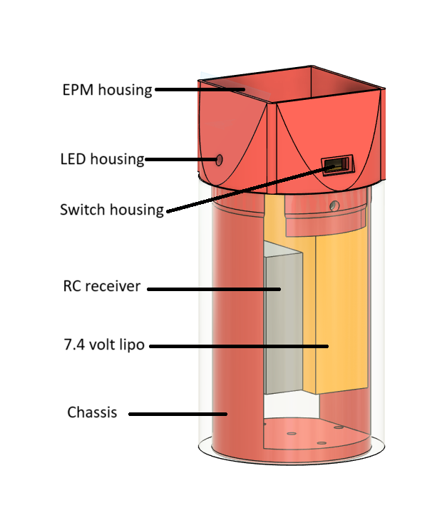

# Dummy package for test
This is a dummy package that only contains electronics to activate the onboard EPM using an RC transmitter. It is powered by a 7.4 volt lipo in conjunction with a buck converter to power the 5V electronics onboard. 

## System design:

CAD model fo the package.

Hardware:

